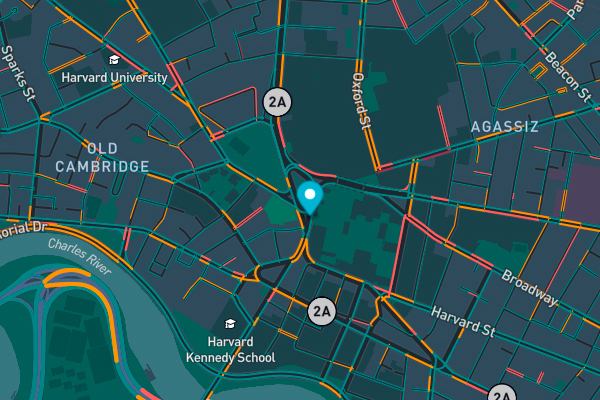

<div align="center" id="top"> 
  

  &#xa0;

  <!-- <a href="https://realtimebustracker.netlify.app">Splash</a> -->
</div>

<h1 align="center">Real Time Bus Tracker</h1>
<hr> -->

<p align="center">
  <a href="#dart-about">About</a> &#xa0; | &#xa0; 
  <a href="#sparkles-features">Features</a> &#xa0; | &#xa0;
  <a href="#rocket-technologies">Technologies</a> &#xa0; | &#xa0;
  <a href="#white_check_mark-requirements">Requirements</a> &#xa0; | &#xa0;
  <a href="#checkered_flag-starting">Installation</a> &#xa0; | &#xa0;
  <a href="#memo-license">License</a> &#xa0; | &#xa0;
  <a href="#recycle-improvements">Improvements</a> &#xa0; | &#xa0;	
  <a href="https://snando2020.github.io/" target="_blank">Author</a>
</p>

<br>

## :book: About ##

This project worked with mapbox and connected through an API to the services by entering a token, and a follow-up of the bus stops between MIT and Harvard was developed.. 

## :sparkles: Features ##

:heavy_check_mark: Map loading on web page

:heavy_check_mark: Map marker defined and animated with coordinates the bus stopped.

## :wrench: Technologies ##

The following tools were used in this project:

- Javascript 
- HTML
- CSS
- Mapbox 

## :white_check_mark: Requirements ##

Create account in mapbox to have access to the token the map

## :checkered_flag: Starting ##

```bash
# Clone this project
$ git clone https://github.com/snando2020/RealTimeBusTracker

# Access
$ cd RealTimeBusTracker

# Just Open the index.html file on your browser

```

## :pincel2: Improvements ##

It would be nice the next improvements:
- [ ] Print the marker of each bus stop.
- [ ] Using the style map Navigation Night.

## :memo: License ##

This project is under license from MIT.


Made with :heart: by <a href="https://snando2020.github.io/" target="_blank">Saul F. Vega Montenegro</a>

&#xa0;

<a href="#top">Back to top</a>
